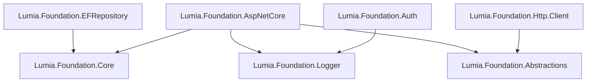

# Lumia.Foundation

Conjunto de bibliotecas .NET reutilizáveis para acelerar o desenvolvimento de APIs ASP.NET Core: abstrações de domínio, repositório genérico sobre EF Core, autenticação JWT/Identity, cliente HTTP tipado, logging estruturado e tratamento padronizado de erros.

Cada pacote é publicado individualmente no NuGet e pode ser usado isoladamente ou em conjunto.

## Pacotes

| Pacote | Descrição | Versão | Docs |
| :--- | :--- | :--- | :--- |
| `Lumia.Foundation.Core` | `Entity`, `DomainBaseException`, `CommandValidator`, `IDateTimeProvider` e utilitários de uso comum. Base para os demais pacotes. | 0.11.0 | [readme](LumiaFoundation.Core/docs/readme.md) |
| `Lumia.Foundation.Abstractions` | Modelo `ErrorDetails` para padronizar respostas de erro entre APIs e clientes HTTP. | 0.1.0 | [readme](LumiaFoundation.Abstractions/docs/readme.md) |
| `Lumia.Foundation.Logger` | Interface de logging (`ILoggerManager`) baseada em NLog, com suporte a log estruturado. | 0.4.0 | [readme](LumiaFoundation.Logger/docs/readme.md) |
| `Lumia.Foundation.EFRepository` | `RepositoryContext`, `BaseRepository<T>` e configuração de conexão para MySQL/MariaDB/PostgreSQL via EF Core. | 0.9.1 | [readme](LumiaFoundation.EFRepository/docs/readme.md) |
| `Lumia.Foundation.AspNetCore` | Tratamento global de exceções, `BaseApiController`, filtros de ação, registro automático de serviços, OpenAPI/Scalar. | 0.20.0 | [readme](LumiaFoundation.AspNetCore/docs/readme.md) |
| `Lumia.Foundation.Auth` | ASP.NET Core Identity, autenticação JWT, refresh token e filtros para extrair o usuário do token. | 0.2.1 | [readme](LumiaFoundation.Auth/docs/readme.md) |
| `Lumia.Foundation.Http.Client` | Cliente HTTP tipado com `HttpClientFactory`, conversão de erros em `ApiException` e refresh automático de JWT. | 0.2.1 | [readme](LumiaFoundation.Http.Client/docs/readme.md) |

## Requisitos

- **.NET 10.0**
- MySQL, MariaDB ou PostgreSQL, caso use `Lumia.Foundation.EFRepository`/`Lumia.Foundation.Auth`

## Instalação

Instale apenas os pacotes que o projeto precisa:

```bash
dotnet add package Lumia.Foundation.Core
dotnet add package Lumia.Foundation.Abstractions
dotnet add package Lumia.Foundation.Logger
dotnet add package Lumia.Foundation.EFRepository
dotnet add package Lumia.Foundation.AspNetCore
dotnet add package Lumia.Foundation.Auth
dotnet add package Lumia.Foundation.Http.Client
```

Cada pacote tem seu próprio guia de configuração linkado na tabela acima.

## Como os pacotes se relacionam



`Core`, `Abstractions` e `Logger` não têm dependências entre si e servem de base para os demais pacotes.

## Estrutura do repositório

```
LumiaFoundation.Core/           Abstrações de domínio e utilitários
LumiaFoundation.Abstractions/   Modelo de erro compartilhado
LumiaFoundation.Logger/         Logging estruturado (NLog)
LumiaFoundation.EFRepository/   Repositório genérico sobre EF Core
LumiaFoundation.AspNetCore/     Utilitários para APIs ASP.NET Core
LumiaFoundation.Auth/           Identity + JWT
LumiaFoundation.Http.Client/    Cliente HTTP tipado
*.Test/                         Projetos de teste (xUnit) de cada pacote
LumiaFoundation.slnx            Solution com todos os projetos
```

## Testes

```bash
dotnet test LumiaFoundation.slnx
```

## Licença

Distribuído sob a licença definida em [`LICENSE`](LICENSE).

> **Nota:** os `.csproj` dos pacotes atualmente declaram `PackageLicenseExpression = GPL-3.0-or-later` no metadata do NuGet, enquanto o arquivo `LICENSE` da raiz é MIT. Vale alinhar os dois antes da próxima publicação, para não gerar inconsistência entre o que aparece no NuGet.org e o que está no repositório.

## Autor

**Jeann Andrade** — Lumia Tech
